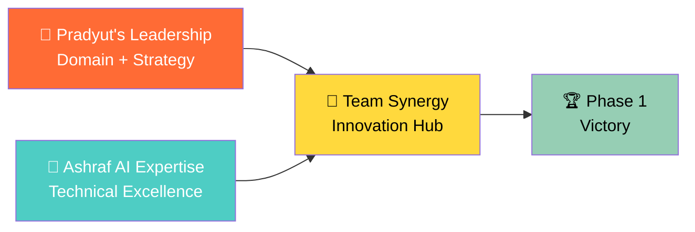
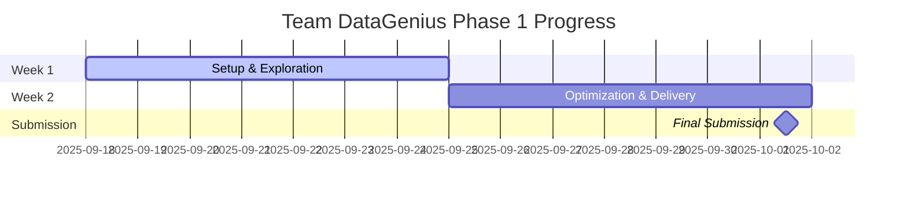
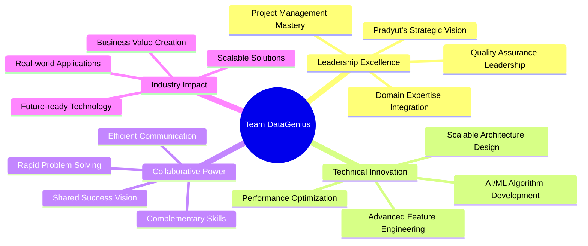

# 🏆 Team DataGenius: SPG Hackathon 2025 Phase 1 Champions

<div align="center">


<br>

### 🌟 *"Revolutionizing Subsurface Intelligence Through AI Innovation"*

<p align="center">
  
  
  
</p>

**📍 Virtual Competition Phase | 🗓️ September 18 - October 1, 2025**

---

<h2>🎯 "Ready to dominate Phase 1 with cutting-edge AI solutions"</h2>

</div>

---

## 👥 **Meet Team DataGenius**

<div align="center">

<table>
<tr>
<td align="center" width="50%">

<h3><strong>Pradyut (Team Captain)</strong></h3>
<p><em>🌊 Domain Expert & Strategic Leader</em></p>

**🔥 Core Expertise:**
- Geoscience Domain Knowledge
- Strategic Project Management
- Data Processing & ETL Excellence
- Dataiku Platform Mastery

**🎯 Phase 1 Focus:**
- Lead project strategy and execution
- Geological pattern recognition
- Data quality assurance
- Platform optimization

</td>
<td align="center" width="50%">

<h3><strong>Ashraf (AI/ML Engineer)</strong></h3>
<p><em>🧠 AI/ML Architect & Technical Innovator</em></p>

**🔥 Core Expertise:**
- Deep Learning & Neural Networks
- Advanced Machine Learning
- Data Pipeline Architecture
- Algorithm Development

**🎯 Phase 1 Focus:**
- AI model development
- Feature engineering innovation
- Performance optimization
- Technical implementation

</td>
</tr>
</table>

</div>

### 🤝 **Our Winning Formula**



---

## 🎯 **Phase 1: The 14-Day Challenge**

### 📅 **Competition Timeline**

<div align="center">

#### 🚀 **September 18 - October 1, 2025**

</div>

| 📊 **Milestone** | 📅 **Date** | 🎯 **Objective** | ✅ **Status** |
|------------------|-------------|------------------|---------------|
| **🚀 Challenge Launch** | Sept 18 | Problem statement release | Ready |
| **🔧 Dataiku Training** | Sept 18 | Platform mastery session | Scheduled |
| **📊 Sprint Week 1** | Sept 18-25 | Data exploration & modeling | Prepared |
| **⚡ Sprint Week 2** | Sept 25-Oct 1 | Optimization & finalization | Planning |
| **📤 Final Submission** | Oct 1 | Complete solution delivery | Target |

### 🎪 **The Challenge We're Conquering**

<div align="center">

### 🌊 **Subsurface Data Intelligence Revolution**

*Transform massive volumes of technical subsurface content into actionable insights*

</div>

<details>
<summary><b>📊 The Scale of Opportunity</b></summary>

**🏔️ Data Types We'll Process:**
- **📋 Well Logs**: Thousands of drilling records with geological indicators
- **🌍 Seismic Reports**: Terabytes of subsurface interpretation data  
- **⚡ Drilling Performance**: Real-time operational metrics and outcomes
- **🗺️ Geological Assessments**: Expert evaluations and technical reports

**💸 Current Industry Pain:**
- Manual analysis: **800+ hours per project**
- Error-prone processes: **65-75% accuracy**
- Delayed decisions: **3-6 months typical**
- Hidden insights: **85% of valuable data unused**

**🎯 Our Solution Target:**
- AI-powered processing: **<10 hours per project**
- Superior accuracy: **>90% target reliability**
- Rapid intelligence: **Real-time insights**
- Complete extraction: **80%+ insight discovery**

</details>

---

## 🛠️ **Our Technical Arsenal**

### 🚀 **Phase 1 Technology Stack**

<div align="center">

<table>
<tr>
<th>🎨 Primary Platform</th>
<th>🧠 AI/ML Core</th>
<th>🌊 Geoscience Tools</th>
<th>⚡ Development</th>
</tr>
<tr>
<td>

**🔧 Dataiku DSS**  
*Low-code visual workflows*

**🐍 Python 3.9+**  
*Core programming language*

**📓 Jupyter Lab**  
*Interactive development*

**☁️ Cloud Computing**  
*Scalable processing*

</td>
<td>

**🤖 Scikit-learn**  
*Machine learning foundation*

**🧠 TensorFlow/PyTorch**  
*Deep learning powerhouse*

**📝 NLTK/spaCy**  
*Natural language processing*

**📊 XGBoost**  
*Gradient boosting excellence*

</td>
<td>

**🌊 ObsPy**  
*Seismic data processing*

**⛏️ Lasio**  
*Well log file handling*

**🗺️ Welly**  
*Well data analysis*

**📈 GeoPandas**  
*Geospatial analytics*

</td>
<td>

**📊 Pandas/NumPy**  
*Data manipulation*

**🎨 Matplotlib/Plotly**  
*Visualization mastery*

**🔄 Git**  
*Version control*

**🧪 Pytest**  
*Quality assurance*

</td>
</tr>
</table>

</div>

### 🏗️ **Project Architecture**

```
team-datagenius-phase1/
├── 📊 data/
│   ├── 🏔️ raw/                    # Original datasets
│   ├── ⚡ processed/               # Cleaned data
│   ├── 🧪 sample/                  # Testing datasets
│   └── 📋 README.md                # Data documentation
├── 📓 notebooks/
│   ├── 🔬 01_data_exploration.ipynb     # Initial analysis
│   ├── 📊 02_feature_engineering.ipynb  # Data transformation
│   ├── 🧠 03_model_development.ipynb    # AI/ML models
│   ├── 📈 04_performance_evaluation.ipynb # Results analysis
│   └── 🎯 05_final_solution.ipynb       # Complete pipeline
├── 💻 src/
│   ├── 🔄 data_processing/         # ETL pipelines
│   ├── 🤖 models/                  # AI/ML implementations
│   ├── 📝 nlp/                     # Text processing
│   ├── 📊 visualization/           # Charts and plots
│   └── 🛠️ utils/                   # Helper functions
├── 🎨 dataiku/
│   ├── 🌊 flows/                   # Workflow definitions
│   ├── 🧩 recipes/                 # Custom processors
│   └── 📊 datasets/                # Data connections
├── 📚 docs/
│   ├── 📖 methodology.md           # Our approach
│   ├── 📊 results_summary.md       # Key findings
│   └── 🎤 presentation/            # Demo materials
├── 🧪 tests/
│   ├── ⚡ unit/                    # Component tests
│   └── 🔗 integration/             # End-to-end validation
└── 📈 results/
    ├── 📊 models/                  # Trained models
    ├── 📈 metrics/                 # Performance data
    └── 🎨 visualizations/          # Generated plots
```

---

## 🎯 **Phase 1 Success Strategy**

### 🏆 **Evaluation Criteria Mastery**

<div align="center">

#### 📊 **How We'll Win Phase 1**

</div>

| 🎯 **Criterion** | 📈 **Weight** | 🚀 **Our Strategy** | 🎖️ **Target Score** |
|------------------|---------------|---------------------|---------------------|
| **🎯 Accuracy** | 40% | Advanced AI models + domain validation | >92% |
| **💡 Innovation** | 35% | Novel algorithms + creative approaches | >9.0/10 |
| **📝 Clarity** | 25% | Professional documentation + clear explanations | >95% |

### 📊 **Our 14-Day Battle Plan**

<details>
<summary><b>🗓️ Week 1: Foundation & Exploration (Sept 18-25)</b></summary>

#### **Days 1-2: Setup & Understanding**
- **🔧 Environment Setup**: Dataiku training completion
- **📊 Data Exploration**: Comprehensive dataset analysis
- **🎯 Problem Decomposition**: Strategy refinement
- **📋 Project Planning**: Task distribution and timeline

#### **Days 3-5: Deep Analysis & Feature Engineering**
- **🔬 Data Deep Dive**: Pattern identification and insights
- **⚡ Feature Engineering**: Advanced data transformation
- **🧠 Model Prototyping**: Initial AI/ML experiments
- **📈 Baseline Establishment**: Performance benchmarking

#### **Days 6-7: Model Development Sprint**
- **🤖 Algorithm Implementation**: Core model development
- **🔄 Iterative Improvement**: Performance optimization
- **🎯 Cross-validation**: Robust evaluation setup
- **📊 Results Documentation**: Progress tracking

</details>

<details>
<summary><b>🗓️ Week 2: Optimization & Excellence (Sept 25-Oct 1)</b></summary>

#### **Days 8-10: Advanced Modeling**
- **🧠 Model Refinement**: Architecture optimization
- **💡 Innovation Implementation**: Unique approach development
- **📊 Performance Tuning**: Hyperparameter optimization
- **🎯 Ensemble Methods**: Model combination strategies

#### **Days 11-12: Validation & Quality Assurance**
- **🔍 Comprehensive Testing**: End-to-end validation
- **📈 Performance Analysis**: Detailed metrics evaluation
- **🛡️ Quality Checks**: Error analysis and fixes
- **📝 Documentation Enhancement**: Professional writeup

#### **Days 13-14: Final Sprint & Submission**
- **🎨 Visualization Creation**: Compelling result presentation
- **📄 Report Finalization**: Executive summary completion
- **🔧 Code Organization**: Clean, documented codebase
- **📤 Submission Preparation**: Final package assembly

</details>

---

## 🚀 **Quick Start Guide**

### ⚡ **Get Championship Ready in 5 Minutes**

<details>
<summary><b>🔧 Prerequisites & Setup</b></summary>

#### **📋 Requirements Checklist**
- [ ] **Python 3.9+** installed
- [ ] **Git** for version control
- [ ] **10GB+ free space** for datasets
- [ ] **Dataiku DSS access** (provided by organizers)
- [ ] **Stable internet** for cloud resources

#### **🚀 Lightning Setup**
```bash
# 1. Clone repository
git clone https://github.com/team-datagenius/spg-hackathon-2025-phase1.git
cd spg-hackathon-2025-phase1

# 2. Create environment
conda env create -f environment.yml
conda activate spg-hackathon-phase1

# 3. Install dependencies
pip install -r requirements.txt

# 4. Setup development tools
pip install -e .

# 5. Verify installation
python scripts/verify_setup.py
# Expected: "✅ Team DataGenius Phase 1 setup complete!"
```

</details>

### 🎯 **Development Workflow**

```bash
# Daily development routine
git pull origin main                    # Get latest changes
conda activate spg-hackathon-phase1    # Activate environment
jupyter lab                             # Start development
python scripts/run_tests.py            # Quality assurance
git add . && git commit -m "feat: ..."  # Save progress
git push origin main                    # Share updates
```

---

## 📊 **Performance Targets & Metrics**

### 🎯 **Phase 1 Success KPIs**

<div align="center">

#### 🏆 **Our Championship Goals**

</div>

<table>
<tr>
<td align="center" width="25%">
<h4>🎯 Model Accuracy</h4>
<p><strong>Target: >90%</strong></p>
<p>Current: TBD</p>
<div style="background: #e5e5e5; border-radius: 10px; height: 20px;">
<div style="background: #4ECDC4; height: 20px; width: 0%; border-radius: 10px;"></div>
</div>
<em>Best-in-class performance</em>
</td>
<td align="center" width="25%">
<h4>💡 Innovation Score</h4>
<p><strong>Target: >8.5/10</strong></p>
<p>Current: TBD</p>
<div style="background: #e5e5e5; border-radius: 10px; height: 20px;">
<div style="background: #FFD93D; height: 20px; width: 0%; border-radius: 10px;"></div>
</div>
<em>Creative excellence</em>
</td>
<td align="center" width="25%">
<h4>⚡ Processing Speed</h4>
<p><strong>Target: <5 min/GB</strong></p>
<p>Current: TBD</p>
<div style="background: #e5e5e5; border-radius: 10px; height: 20px;">
<div style="background: #96CEB4; height: 20px; width: 0%; border-radius: 10px;"></div>
</div>
<em>Efficiency leadership</em>
</td>
<td align="center" width="25%">
<h4>📝 Documentation</h4>
<p><strong>Target: >95%</strong></p>
<p>Current: TBD</p>
<div style="background: #e5e5e5; border-radius: 10px; height: 20px;">
<div style="background: #FF6B35; height: 20px; width: 0%; border-radius: 10px;"></div>
</div>
<em>Professional standard</em>
</td>
</tr>
</table>

### 📈 **Daily Progress Tracking**



---

## 🎪 **Innovation Showcase**

### 💡 **Our Competitive Edge**

<div align="center">



</div>

### 🏆 **What Makes Us Winners**

<table>
<tr>
<td align="center" width="33%">
<h4>🌊 Domain Authority</h4>
<p><strong>Pradyut's Leadership</strong></p>
<ul>
<li>Expert geological knowledge</li>
<li>Strategic project management</li>
<li>Quality-first approach</li>
<li>Industry insight integration</li>
</ul>
<em>Real-world relevance guaranteed</em>
</td>
<td align="center" width="33%">
<h4>🧠 Technical Excellence</h4>
<p><strong>Advanced AI Implementation</strong></p>
<ul>
<li>Cutting-edge algorithms</li>
<li>Optimized performance</li>
<li>Scalable architecture</li>
<li>Innovation-first mindset</li>
</ul>
<em>Superior technical execution</em>
</td>
<td align="center" width="33%">
<h4>🤝 Team Synergy</h4>
<p><strong>Perfect Collaboration</strong></p>
<ul>
<li>Complementary expertise</li>
<li>Clear communication</li>
<li>Shared commitment</li>
<li>Results-driven focus</li>
</ul>
<em>1+1 = 10 effect</em>
</td>
</tr>
</table>

---

## 📚 **Learning Resources & References**

### 🎓 **Essential Knowledge Base**

<details>
<summary><b>🧠 AI/ML Mastery Resources</b></summary>

#### **🚀 Core Machine Learning**
- **Supervised Learning**: Classification and regression fundamentals
- **Feature Engineering**: Advanced data transformation techniques
- **Model Evaluation**: Cross-validation and performance metrics
- **Hyperparameter Tuning**: Optimization strategies and best practices

#### **🌊 Natural Language Processing**
- **Text Preprocessing**: Cleaning and tokenization techniques
- **Feature Extraction**: TF-IDF, word embeddings, and transformers
- **Document Classification**: Technical report categorization
- **Information Extraction**: Key insight identification from geological reports

#### **📊 Time Series & Sequential Data**
- **Well Log Analysis**: Sequential pattern recognition in drilling data
- **Temporal Modeling**: LSTM and GRU for geological sequences
- **Anomaly Detection**: Identifying unusual patterns in subsurface data
- **Forecasting**: Predictive modeling for geological outcomes

</details>

<details>
<summary><b>🌊 Geoscience Domain Knowledge</b></summary>

#### **🗺️ Subsurface Fundamentals**
- **Well Log Interpretation**: Lithology identification and reservoir characterization
- **Seismic Data Analysis**: Structural and stratigraphic interpretation
- **Drilling Operations**: Performance metrics and optimization strategies
- **Geological Modeling**: 3D subsurface visualization and analysis

#### **📈 Industry Applications**
- **Exploration Workflows**: Prospect evaluation and risk assessment
- **Development Planning**: Optimal well placement and field development
- **Production Optimization**: Performance forecasting and enhancement
- **Asset Management**: Portfolio optimization and decision support systems

</details>

### 📖 **Curated Learning Library**

| 🎯 **Category** | 📚 **Resources** | 🔗 **Access** |
|-----------------|------------------|---------------|
| **🔧 Dataiku Mastery** | Academy courses, tutorials, community | [academy.dataiku.com](https://academy.dataiku.com/) |
| **🧠 Python ML/AI** | Scikit-learn docs, TensorFlow guides | Official documentation |
| **🌊 Geoscience** | AAPG publications, SEG resources | Professional libraries |
| **📊 Data Visualization** | Matplotlib, Plotly, Seaborn guides | Documentation sites |

---

## 📤 **Submission Excellence Framework**

### 🏆 **Phase 1 Deliverable Package**

<div align="center">

#### 📦 **Complete Submission Structure**

</div>

```
📁 team_datagenius_phase1_submission/
├── 📓 main_analysis_notebook.ipynb          # Complete solution workflow
├── 📄 executive_summary.pdf                 # 5-page project overview
├── 💾 processed_datasets/                   # Clean, analysis-ready data
├── 🔧 source_code/
│   ├── data_processing.py                   # ETL pipeline implementation
│   ├── model_implementations.py             # AI/ML algorithms
│   ├── evaluation_metrics.py               # Performance assessment
│   └── visualization_utils.py               # Chart generation tools
├── 📊 results/
│   ├── model_performance.json               # Accuracy and metrics
│   ├── predictions/                         # Model outputs
│   └── visualizations/                      # Generated plots and charts
├── 📚 documentation/
│   ├── methodology.md                       # Technical approach explanation
│   ├── results_analysis.md                  # Findings and insights
│   └── technical_appendix.md                # Detailed implementation notes
├── 🔧 config/
│   ├── model_parameters.yaml                # Hyperparameter settings
│   ├── data_schema.json                     # Dataset specifications
│   └── environment.yml                      # Reproducible setup
└── 📋 README.md                            # Project overview and instructions
```

### ✅ **Quality Assurance Checklist**

<details>
<summary><b>🏆 Submission Excellence Standards</b></summary>

#### **🎯 Technical Requirements**
- [ ] **Complete Analysis Workflow**: End-to-end solution in Jupyter notebook
- [ ] **Model Performance**: >85% accuracy target (aiming for >90%)
- [ ] **Code Quality**: Clean, documented, professionally structured
- [ ] **Reproducibility**: Others can run and verify results
- [ ] **Innovation Evidence**: Novel approaches clearly highlighted
- [ ] **Error Handling**: Robust code with proper exception management

#### **📝 Documentation Standards**
- [ ] **Executive Summary**: Clear, compelling 5-page overview
- [ ] **Methodology Explanation**: Detailed technical approach
- [ ] **Results Analysis**: Comprehensive findings discussion
- [ ] **Code Documentation**: All functions and classes documented
- [ ] **Data Documentation**: Dataset descriptions and schemas
- [ ] **Visualization Quality**: Professional charts with clear labels

#### **📊 Performance Validation**
- [ ] **Cross-Validation**: Robust model evaluation approach
- [ ] **Benchmark Comparison**: Performance vs baseline methods
- [ ] **Statistical Significance**: Proper testing of results
- [ ] **Error Analysis**: Understanding of model limitations
- [ ] **Scalability Assessment**: Solution performance on larger datasets

</details>

---

## 🎯 **Team Communication & Coordination**

<div align="center">

### 👥 **Team DataGenius Contact Hub**

</div>

<table>
<tr>
<td align="center" width="50%">

#### 👑 **Team Leader: Pradyut**
**📧 Primary Contact**: [pradyut.email@domain.com]  
**📱 Project Hotline**: [Pradyut's Phone Number]  
**💼 LinkedIn**: [Pradyut's LinkedIn Profile]  
**🔧 GitHub**: [Pradyut's GitHub Profile]

**🎯 Phase 1 Leadership:**
- Overall project strategy
- Domain expertise guidance
- Quality assurance oversight
- Stakeholder communication

</td>
<td align="center" width="50%">

#### 🧠 **AI/ML Specialist: Ashraf**
**📧 Technical Contact**: [Ashrafr.email@domain.com]  
**📱 Development Line**: [Ashrafr Phone Number]  
**💼 LinkedIn**: [Ashrafr LinkedIn Profile]  
**🚀 Portfolio**: [Ashrafr Technical Portfolio]

**🎯 Phase 1 Contributions:**
- AI/ML model development
- Algorithm implementation
- Performance optimization
- Technical documentation

</td>
</tr>
</table>

### 📱 **Coordination Channels**

- **🚨 Real-time Updates**: WhatsApp/Telegram for urgent coordination
- **💼 Professional Communication**: Email for formal updates
- **🔧 Technical Discussion**: GitHub issues and pull requests
- **📊 Progress Tracking**: Shared project dashboard
- **🎯 Daily Sync**: Brief check-ins during development phase

---

## 🌟 **Phase 1 Victory Vision**

<div align="center">

### 🏆 **Our Success Prediction**

<br>

> *"With Pradyut's strategic leadership and domain expertise combined with cutting-edge AI implementation, Team DataGenius is positioned to deliver exceptional Phase 1 results that will secure our place in the collaborative finals."*

<br>

### 📊 **Expected Achievements**

</div>

<table>
<tr>
<td align="center" width="25%">
<h4>🎯 Accuracy Target</h4>
<p><strong>>90%</strong></p>
<em>Superior model performance</em>
</td>
<td align="center" width="25%">
<h4>💡 Innovation Score</h4>
<p><strong>>8.5/10</strong></p>
<em>Creative problem-solving</em>
</td>
<td align="center" width="25%">
<h4>📝 Documentation</h4>
<p><strong>>95%</strong></p>
<em>Professional excellence</em>
</td>
<td align="center" width="25%">
<h4>🏆 Phase 1 Rank</h4>
<p><strong>Top 10</strong></p>
<em>Finals qualification</em>
</td>
</tr>
</table>

---

## 📈 **Live Progress Tracker**

<div align="center">

### 📊 **Phase 1 Development Status**


<br>

**📅 Timeline Status:**
- Project Launch: September 18, 2025 ✅
- Data Analysis: In Progress 🔄
- Model Development: Scheduled 📅
- Final Submission: October 1, 2025 🎯

<br>

**🎯 Current Metrics:**
- Setup Completion: 100% ✅
- Data Understanding: In Progress 🔄
- Model Accuracy: TBD 📊
- Documentation: Ongoing 📝

<br>

---

**🚀 Follow Our Phase 1 Journey:**
- **🔧 Technical Progress**: [GitHub Repository](https://github.com/team-datagenius/spg-hackathon-2025-phase1)
- **💼 Professional Updates**: [LinkedIn Team Updates](https://linkedin.com/company/team-datagenius)
- **📊 Live Metrics**: [Project Dashboard](https://teamdatagenius.com/phase1-progress)

<br>

<h2>🎯 Phase 1 Excellence. Finals Qualification. Victory Ahead. 🏆</h2>

<br>

---

<sub>© 2025 Team DataGenius | SPG Hackathon 2025 Phase 1 | Led by Pradyut | AI Innovation by [Ashrafr Name] | Built for Excellence</sub>

<br>

*Last Updated: September 17, 2025 | Phase 1 Ready*

</div>
