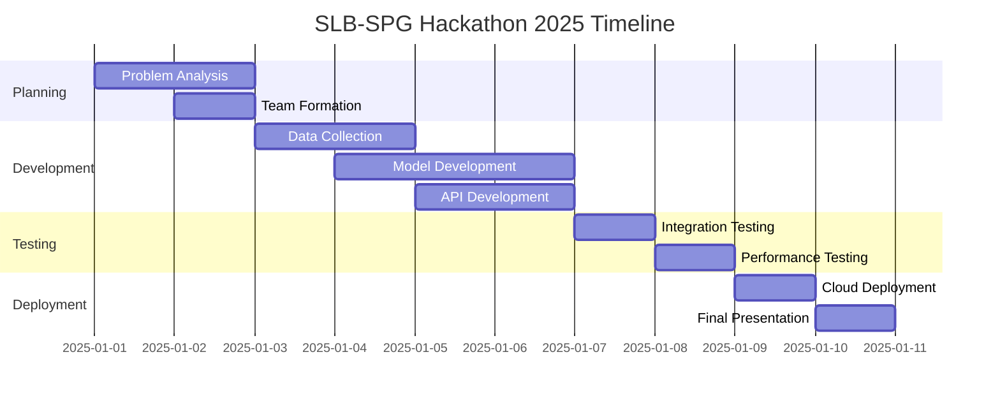

# 🌍 SLB–SPG Hackathon 2025 | Project Title TBD

<div align="center">
  
[](https://github.com)
[](https://github.com)
[](https://github.com)

*Innovating the future of energy through cutting-edge technology*

</div>

---

## 🚀 Overview

This repository contains our submission for the **SLB–SPG Hackathon 2025**, a premier event bringing together the brightest minds in energy technology and digital innovation. Our team is developing a comprehensive solution that leverages advanced data science, machine learning, and cloud technologies to address critical challenges in the energy sector.

The repository will serve as the central hub for our project development, containing all source code, data analysis notebooks, documentation, and deployment configurations needed to demonstrate our innovative approach to solving real-world energy challenges.

---

## 🎯 Problem Statement

### 📋 **Status: To Be Decided**

*Our team is currently evaluating multiple high-impact problem statements within the energy and technology domain. The final problem statement will be updated here once confirmed, along with detailed background research and market analysis.*

**Potential Focus Areas:**
- 🔋 Energy optimization and sustainability
- 🌐 Digital transformation in energy systems
- 📊 Advanced data analytics for operational efficiency
- 🤖 AI-driven predictive maintenance and monitoring

---

## 🎯 Objectives & Approach

### **Primary Objectives**
- 💡 **Innovation**: Develop cutting-edge solutions using state-of-the-art technology
- 📈 **Impact**: Create measurable improvements in efficiency, sustainability, or cost-effectiveness
- 🔧 **Scalability**: Design solutions that can be deployed across diverse environments
- 🤝 **User-Centric**: Focus on practical applications that address real user needs

### **Methodology**
- 🔍 **Research & Analysis**: Comprehensive problem analysis and solution research
- 🛠️ **Rapid Prototyping**: Agile development with iterative testing and refinement
- 📊 **Data-Driven Insights**: Leverage analytics and ML for intelligent decision-making
- 🧪 **Validation**: Rigorous testing and performance evaluation
- 🚀 **Deployment**: Cloud-ready solution with scalable architecture

---

## 🛠️ Tech Stack

<div align="center">

### **Core Technologies**


### **Machine Learning & AI**


### **Cloud & Infrastructure**


</div>

**Additional Tools:**
- 📊 **Data Processing**: NumPy, SciPy, Apache Spark
- 📈 **Visualization**: Matplotlib, Plotly, Tableau
- 🗄️ **Database**: PostgreSQL, MongoDB, Redis
- ⚡ **API Framework**: FastAPI, Flask
- 🔄 **Version Control**: Git, GitHub Actions (CI/CD)

---

## 📂 Repository Structure

```
📦 hackathon-project/
├── 📁 data/
│   ├── 📁 raw/                 # Original, unmodified data
│   ├── 📁 processed/           # Cleaned and transformed data
│   └── 📁 external/            # External datasets and APIs
├── 📁 notebooks/
│   ├── 📁 exploratory/         # Data exploration and analysis
│   ├── 📁 modeling/            # ML model development
│   └── 📁 visualization/       # Charts, graphs, and dashboards
├── 📁 src/
│   ├── 📁 data/                # Data processing scripts
│   ├── 📁 models/              # ML model definitions
│   ├── 📁 api/                 # REST API endpoints
│   ├── 📁 utils/               # Utility functions and helpers
│   └── 📁 config/              # Configuration files
├── 📁 tests/
│   ├── 📁 unit/                # Unit tests
│   └── 📁 integration/         # Integration tests
├── 📁 docs/
│   ├── 📁 architecture/        # System design and architecture
│   ├── 📁 api/                 # API documentation
│   └── 📁 deployment/          # Deployment guides
├── 📁 docker/                  # Docker configurations
├── 📁 scripts/                 # Automation and utility scripts
├── 📄 requirements.txt         # Python dependencies
├── 📄 Dockerfile             # Container configuration
├── 📄 docker-compose.yml     # Multi-container setup
├── 📄 .env.example           # Environment variables template
└── 📄 README.md              # This file
```

---

## 🔧 Installation & Usage

### **Prerequisites**
- Python 3.9+ 🐍
- Docker & Docker Compose 🐳
- Git 📝

### **Quick Start**

```bash
# Clone the repository
git clone https://github.com/[username]/hackathon-project.git
cd hackathon-project

# Create virtual environment
python -m venv venv
source venv/bin/activate  # On Windows: venv\Scripts\activate

# Install dependencies
pip install -r requirements.txt

# Set up environment variables
cp .env.example .env
# Edit .env with your configuration

# Run the application
python src/main.py
```

### **Docker Setup** 🐳

```bash
# Build and run with Docker Compose
docker-compose up --build

# Access the application
# Web Interface: http://localhost:8000
# API Documentation: http://localhost:8000/docs
```

### **Development Setup** 🛠️

```bash
# Install development dependencies
pip install -r requirements-dev.txt

# Run tests
pytest tests/

# Code formatting
black src/ tests/
flake8 src/ tests/

# Start Jupyter Lab for notebooks
jupyter lab notebooks/
```

---

## 👥 Team Members


## 📊 Project Timeline



---

## 🏆 Achievements & Metrics

- 🎯 **Innovation Score**: *To be measured*
- 📈 **Performance Metrics**: *To be defined*
- 🌱 **Sustainability Impact**: *To be quantified*
- 👥 **User Adoption**: *To be tracked*

---

## 🤝 Acknowledgements

<div align="center">

### **Special Thanks To**

**🏢 SLB (Schlumberger Limited)**  
*For providing the platform and expertise to drive innovation in energy technology*

**🏢 SPG (Societe de Production de Gaz)**  
*For their industry insights and collaboration opportunities*

**🎉 Hackathon Organizers**  
*For creating an environment that fosters creativity, collaboration, and technological advancement*

**🌟 Mentors & Advisors**  
*For their guidance, feedback, and support throughout the development process*

</div>

---

## 📜 License

This project is licensed under the **MIT License** - see the [LICENSE](LICENSE) file for details.

```
MIT License

Copyright (c) 2025 SLB-SPG Hackathon 2025 Team

Permission is hereby granted, free of charge, to any person obtaining a copy
of this software and associated documentation files (the "Software"), to deal
in the Software without restriction, including without limitation the rights
to use, copy, modify, merge, publish, distribute, sublicense, and/or sell
copies of the Software...
```

---

<div align="center">

### 🚀 **Ready to Innovate the Future of Energy!**

[](https://github.com)
[](https://github.com)
[](https://github.com/pradyutlaha)

*Built with ❤️ for the SLB–SPG Hackathon 2025*

</div>
