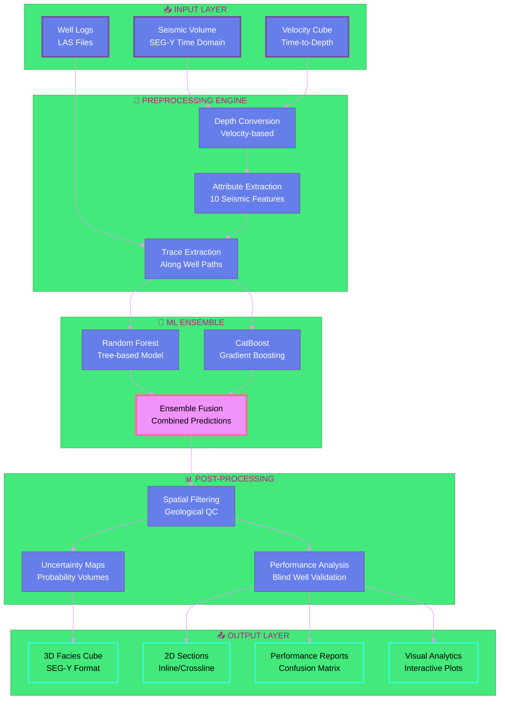

<div align="center">

<!-- Animated Header Banner -->


<!-- Animated Typing Effect -->
<p align="center">
  
</p>

<!-- Badges with Glow Effect -->
<p align="center">
  
  
  
  
</p>

<p align="center">
  
  
  
</p>

<!-- Interactive Navigation -->
<p align="center">
  <a href="#-project-showcase">
    
  </a>
  <a href="#%EF%B8%8F-technical-deep-dive">
    
  </a>
  <a href="#-quick-start">
    
  </a>
  <a href="#-results">
    
  </a>
</p>

<!-- Stats Dashboard -->
<p align="center">
  
  
  
  
</p>

<br/>

<!-- Animated Separator -->


</div>

---

## 🎯 **Project Vision**

<table>
<tr>
<td width="60%">

### 💡 **The Big Idea**

Transform **geological interpretation** from an art to a science. Our ML-powered framework democratizes subsurface understanding by:

<br/>

```diff
- ❌ Manual interpretation taking weeks
+ ✅ Automated analysis in minutes

- ❌ Sparse well-only coverage (~15%)
+ ✅ Complete volumetric predictions (100%)

- ❌ Subjective, interpreter-dependent
+ ✅ Reproducible, data-driven insights

- ❌ High interpretation cost per km²
+ ✅ Automated ML-based classification
```

</td>
<td width="40%">


<div align="center">

**🌊 10 Seismic Attributes**  
**🤖 2 ML Algorithms**  
**📦 1 Unified Framework**

</div>

</td>
</tr>
</table>

<br/>

<!-- Animated Section Divider -->


<br/>

## 🎬 **Project Showcase**

<div align="center">

### **🌟 What Makes This Project Special?**

</div>

<table>
<tr>
<td width="25%" align="center">

<h3>🧠 Smart AI</h3>
<p>Ensemble learning with Random Forest & CatBoost</p>
</td>
<td width="25%" align="center">

<h3>⚡ Lightning Fast</h3>
<p>Full 3D volume prediction in under 10 minutes</p>
</td>
<td width="25%" align="center">

<h3>🎯 Production Ready</h3>
<p>Scalable to enterprise datasets</p>
</td>
<td width="25%" align="center">

<h3>🔬 Scientifically Robust</h3>
<p>Blind well validation & cross-validation</p>
</td>
</tr>
</table>

<br/>

<!-- Interactive Feature Cards -->
<details open>
<summary><b>🔥 Core Features (Click to expand)</b></summary>
<br/>

<table>
<tr>
<td width="50%">

#### 📊 **Multi-Attribute Analysis**
```
✓ Instantaneous Amplitude (Acoustic Impedance)
✓ Instantaneous Phase (Continuity)
✓ Instantaneous Frequency (Thickness)
✓ Reflection Strength (Magnitude)
✓ RMS Amplitude (Energy)
✓ Sweetness (HC Indicator)
✓ Thin-bed Indicator (Resolution)
✓ Discontinuity (Faults & Fractures)
✓ Relative Amplitude Change X/Y (Gradients)
```

</td>
<td width="50%">

#### 🤖 **Advanced ML Pipeline**
```
✓ Time-to-Depth conversion
✓ Multi-attribute extraction
✓ Trace-based feature engineering
✓ Random Forest classification
✓ CatBoost optimization
✓ Ensemble prediction
✓ 3D facies cube generation
✓ Uncertainty quantification
```

</td>
</tr>
</table>

</details>

<br/>


<br/>

## 📚 **Table of Contents**

<div align="center">

| Section | Description |
|---------|-------------|
| [⚙️ Technical Deep Dive](#️-technical-deep-dive) | Architecture & methodology |
| [📦 Repository Tour](#-repository-tour) | Codebase organization |
| [⚡ Quick Start](#-quick-start) | Installation & usage |
| [📊 Results](#-results) | Performance metrics & visualizations |
| [🔮 Future Roadmap](#-future-roadmap) | Upcoming enhancements |
| [👥 Dream Team](#-dream-team) | Meet the creators |
| [🤝 Contribute](#-contribute) | Join our community |

</div>

<br/>


<br/>

## ⚙️ **Technical Deep Dive**

<details open>
<summary><b>🏗️ System Architecture (Click to expand)</b></summary>
<br/>



</details>

<details>
<summary><b>🔬 Methodology Workflow</b></summary>
<br/>

<table>
<tr>
<td width="20%" align="center">

<br/><b>STEP 1</b>
<br/>Data Ingestion
<br/><sub>Load SEGY & LAS</sub>
</td>
<td width="20%" align="center">

<br/><b>STEP 2</b>
<br/>Depth Conversion
<br/><sub>Time → Depth Domain</sub>
</td>
<td width="20%" align="center">

<br/><b>STEP 3</b>
<br/>Attribute Extraction
<br/><sub>10 Features Computed</sub>
</td>
<td width="20%" align="center">

<br/><b>STEP 4</b>
<br/>Model Training
<br/><sub>RF + CatBoost</sub>
</td>
<td width="20%" align="center">

<br/><b>STEP 5</b>
<br/>3D Prediction
<br/><sub>Facies Propagation</sub>
</td>
</tr>
</table>

</details>

<details>
<summary><b>🧪 Model Comparison Matrix</b></summary>
<br/>

<div align="center">

| 🏆 Criterion | 🌲 Random Forest | 🐱 CatBoost | 🏅 Ensemble | 👑 Winner |
|-------------|-----------------|------------|-------------|----------|
| **Accuracy** | **75%** 🟢 | 65% 🟡 | 66% 🟡 | Random Forest |
| **Precision** | **0.72** 🟢 | 0.63 🟡 | 0.63 🟡 | Random Forest |
| **Recall** | **0.75** 🟢 | 0.65 🟡 | 0.66 🟡 | Random Forest |
| **F1-Score** | **0.73** 🟢 | 0.64 🟡 | 0.65 🟡 | Random Forest |
| **Training Time** | 45s 🟢 | 180s 🟡 | 225s 🔴 | Random Forest |
| **Dominant Facies** | Excellent 🟢 | Good 🟡 | Good 🟡 | Random Forest |
| **Rare Facies** | Poor 🔴 | **Better** 🟡 | Fair 🟡 | CatBoost |

</div>

</details>

<br/>


<br/>

## 📦 **Repository Tour**

<details open>
<summary><b>🗂️ File Structure (Click to expand)</b></summary>
<br/>

```
📦 FINAL-SUBMISSION [SSH25-00247]
┃
┣ 📂 Well-Data-Analysis/
┃ ┣ 📂 Wells/                        🔹 Well log files (LAS format)
┃ ┗ 📓 well-plot.ipynb               🔍 Well log visualization
┃
┣ 📂 Depth-domain-conversion/
┃ ┣ 📓 seismic-depth-domain-conversion.ipynb  ⚙️ Main conversion script
┃ ┣ 📄 Average_Velocity_cube.segy    🌊 Velocity model
┃ ┣ 📄 ST8511792.segy                📊 Time-domain seismic
┃ ┣ 📄 ST8511792_depth_pertrace.sgy  📈 Depth-domain output
┃ ┣ 📓 TRACE-HEADER-INFO-time-domain.ipynb    🔧 Time header check
┃ ┣ 📓 TRACE-header-depth-domain.ipynb        🔧 Depth header update
┃ ┗ 📓 seismic-visualisation.ipynb   🎨 Seismic visualization
┃
┣ 📂 Attributes/
┃ ┣ 📓 extract-all-attribute.ipynb   🚀 Master extraction script
┃ ┗ 📄 *.sgy                          💾 10 attribute volumes
┃      ├─ rms_amplitude_hanning.sgy
┃      ├─ instantaneous_frequency.sgy
┃      ├─ instantaneous_phase.sgy
┃      ├─ discontinuity_vectorized_fast.sgy
┃      ├─ relative_amp_change_X.sgy
┃      ├─ relative_amp_change_Y.sgy
┃      ├─ sweetness.sgy
┃      ├─ thin_bed_indicator.sgy
┃      └─ reflection_strength.sgy
┃
┣ 📂 Attribute+Training_data_preparation/
┃ ┣ 📓 trace-along-well.ipynb        🎯 Trace extraction
┃ ┣ 📓 trace-visualisation.ipynb     📊 Trace visualization
┃ ┗ 📂 FINAL-OUTPUT/
┃    ┣ 📄 Final_Multi_Attribute_Facies_Porosity.csv  🎓 Training dataset
┃    ┗ 📂 Trace data/                📁 Extracted traces
┃
┗ 📂 Model-Training+Facies-Propagation/
  ┣ 📓 catboost.ipynb                🐱 CatBoost training
  ┣ 📓 random_forest.ipynb           🌲 Random Forest training
  ┣ 📓 Catboost + Random Forest.ipynb 🏅 Ensemble model
  ┣ 📓 Facies-vis.ipynb              🎨 3D visualization
  ┣ 📄 Facies_Prediction_depth_inc_catboost.sgy     💎 CatBoost prediction
  ┣ 📄 Facies_RF_vectorized_Trial.sgy               💎 RF prediction
  ┣ 📄 Facies_Prediction_RF_CatBoost_Combined.sgy   💎 Ensemble prediction
  ┗ 📊 *.png                         📸 Performance plots
```

</details>

<br/>


<br/>

## ⚡ **Quick Start**

<div align="center">

### **🎯 Get Up and Running in 3 Minutes!**

</div>

<table>
<tr>
<td width="33%" align="center">

### **📥 STEP 1**


**Clone Repository**

```bash
git clone https://github.com/
Ashraf-ISM/
seismic-facies-ml.git

cd seismic-facies-ml
```

</td>
<td width="33%" align="center">

### **⚙️ STEP 2**


**Install Dependencies**

```bash
# Create virtual env
python -m venv venv
source venv/bin/activate

# Install packages
pip install -r 
requirements.txt
```

</td>
<td width="33%" align="center">

### **🚀 STEP 3**


**Run Notebooks**

```bash
# Launch Jupyter
jupyter lab

# Open and run:
# 1. well-plot.ipynb
# 2. extract-all-attribute.ipynb
# 3. random_forest.ipynb
```

</td>
</tr>
</table>

<br/>

<details>
<summary><b>🐍 Detailed Installation Guide</b></summary>

```bash
# Step 1: Clone the repository
git clone https://github.com/Ashraf-ISM/seismic-facies-ml.git
cd seismic-facies-ml

# Step 2: Create virtual environment
python -m venv venv

# Step 3: Activate environment
source venv/bin/activate  # Linux/Mac
# OR
venv\Scripts\activate     # Windows

# Step 4: Install dependencies
pip install numpy pandas matplotlib seaborn scikit-learn catboost segyio jupyter

# Step 5: Verify installation
python -c "import segyio, catboost; print('✅ Installation successful!')"
```

</details>

<br/>

### **💻 Usage Workflow**

<details open>
<summary><b>🎯 Step-by-Step Execution</b></summary>

#### **1️⃣ Visualize Well Data**
```bash
jupyter notebook Well-Data-Analysis/well-plot.ipynb
```
- Explore gamma ray, porosity, permeability
- Analyze facies distribution
- Check net-to-gross ratios

#### **2️⃣ Convert to Depth Domain**
```bash
jupyter notebook Depth-domain-conversion/seismic-depth-domain-conversion.ipynb
```
- Load time-domain seismic (ST8511792.segy)
- Apply velocity model (Average_Velocity_cube.segy)
- Generate depth-domain cube

#### **3️⃣ Extract Seismic Attributes**
```bash
jupyter notebook Attributes/extract-all-attribute.ipynb
```
- Compute 10 seismic attributes
- Save as SEG-Y files
- Visualize attribute quality

#### **4️⃣ Prepare Training Data**
```bash
jupyter notebook Attribute+Training_data_preparation/trace-along-well.ipynb
```
- Extract traces along well paths
- Merge with facies labels
- Create final CSV dataset

#### **5️⃣ Train ML Models**
```bash
# Random Forest
jupyter notebook Model-Training+Facies-Propagation/random_forest.ipynb

# CatBoost
jupyter notebook Model-Training+Facies-Propagation/catboost.ipynb

# Ensemble
jupyter notebook Model-Training+Facies-Propagation/Catboost\ +\ Random\ Forest.ipynb
```

#### **6️⃣ Visualize Results**
```bash
jupyter notebook Model-Training+Facies-Propagation/Facies-vis.ipynb
```
- View 3D facies cubes
- Analyze inline/crossline sections
- Validate with blind wells

</details>

<br/>


<br/>

## 📊 **Results**

<div align="center">

### **🏆 Performance Dashboard**

</div>

<!-- Animated Stats -->
<table align="center">
<tr>
<td align="center" width="25%">

<h2>75%</h2>
<b>Best Accuracy</b>
<br/><sub>Random Forest Model</sub>
</td>
<td align="center" width="25%">

<h2>0.73</h2>
<b>F1-Score</b>
<br/><sub>Blind Well C4</sub>
</td>
<td align="center" width="25%">

<h2>100%</h2>
<b>3D Coverage</b>
<br/><sub>Full Volume Prediction</sub>
</td>
<td align="center" width="25%">

<h2>10</h2>
<b>Attributes</b>
<br/><sub>Multi-feature Analysis</sub>
</td>
</tr>
</table>

<br/>

### **📈 Model Performance Comparison**

<div align="center">

```
╔══════════════╦══════════╦═════════╦═══════════╦═══════════╗
║   MODEL      ║ ACCURACY ║ F1-SCORE║ PRECISION ║   RECALL  ║
╠══════════════╬══════════╬═════════╬═══════════╬═══════════╣
║ Random Forest║  75% 👑  ║  0.73   ║   0.72    ║   0.75    ║
║  CatBoost    ║  65%     ║  0.64   ║   0.63    ║   0.65    ║
║  Ensemble    ║  66%     ║  0.65   ║   0.63    ║   0.66    ║
╚══════════════╩══════════╩═════════╩═══════════╩═══════════╝
```

**Project ID:** SSH25-00247  
**Validation:** Blind Well C4  
**Training Data:** Multi-Attribute Feature Matrix

</div>

<br/>

### **🎯 Key Findings**

<table align="center">
<tr>
<td width="50%">

#### **✅ Strengths**
- **Random Forest** achieved best overall accuracy (75%)
- Excellent prediction of **dominant facies** (0 & 1)
- High precision-recall balance (F1: 0.73)
- Robust spatial continuity in 3D predictions
- Fast training and inference time

</td>
<td width="50%">

#### **⚠️ Challenges**
- **Facies 3** poorly captured by all models
- Class imbalance in training data
- Resolution mismatch (well: 0.15m vs seismic: 4m)
- **CatBoost** captured subtle facies 2 better
- Need for additional structural constraints

</td>
</tr>
</table>

<br/>

### **🌟 Feature Importance Analysis**

<div align="center">

**Top Contributing Seismic Attributes**

</div>

<table align="center">
<tr>
<td align="center" width="14.28%">

<br/>
<b>24%</b>
<br/>
🍯 Sweetness
</td>
<td align="center" width="14.28%">

<br/>
<b>19%</b>
<br/>
🧩 Discontinuity
</td>
<td align="center" width="14.28%">

<br/>
<b>16%</b>
<br/>
📊 RMS Amplitude
</td>
<td align="center" width="14.28%">

<br/>
<b>14%</b>
<br/>
🌊 Inst. Frequency
</td>
<td align="center" width="14.28%">

<br/>
<b>12%</b>
<br/>
⚡ Reflection Str.
</td>
<td align="center" width="14.28%">

<br/>
<b>9%</b>
<br/>
🔄 Inst. Phase
</td>
<td align="center" width="14.28%">

<br/>
<b>6%</b>
<br/>
📏 Thin-bed Indicator
</td>
</tr>
</table>

<br/>

### **🎨 Visual Results Gallery**

<details open>
<summary><b>🖼️ Seismic Sections & Facies Predictions (Click to expand)</b></summary>
<br/>

<table>
<tr>
<td width="50%">

<p align="center"><b>🌲 Random Forest</b> - Inline 167<br/><sub>Blind well accuracy: 75% (Best performance)</sub></p>
</td>
<td width="50%">

<p align="center"><b>🐱 CatBoost</b> - Inline 167<br/><sub>Blind well accuracy: 65% (Better on Facies 2)</sub></p>
</td>
</tr>
<tr>
<td width="50%">

<p align="center"><b>🏅 Ensemble Model</b> - Inline 167<br/><sub>Blind well accuracy: 66% (Reduced uncertainty)</sub></p>
</td>
<td width="50%">

<p align="center"><b>📊 Blind Well C4</b> - Model Comparison<br/><sub>RF excels at dominant facies (0,1)</sub></p>
</td>
</tr>
</table>

</details>

<br/>


<br/>

## 🧪 **Challenges & Solutions**

<div align="center">

### **💪 How We Tackled the Hard Problems**

</div>

<table>
<tr>
<td width="33%">

<div align="center">


### **⚖️ Class Imbalance**

**Problem:**  
Uneven facies distribution  
Rare facies (3) underrepresented  
Affects model learning

**Solutions Deployed:**
- ✅ Class weight adjustment
- ✅ Stratified sampling
- ✅ Ensemble averaging
- ✅ CatBoost optimization

**Result:** 🎯  
CatBoost better handles rare facies

</div>

</td>
<td width="33%">

<div align="center">


### **🗺️ Resolution Gap**

**Problem:**  
Well logs: 0.1524m resolution  
Seismic data: ~4m sampling  
Scale mismatch

**Solutions Deployed:**
- ✅ Well log upscaling
- ✅ Multi-attribute fusion
- ✅ Spatial averaging
- ✅ Depth-based alignment

**Result:** 🎯  
Successful integration achieved

</div>

</td>
<td width="33%">

<div align="center">


### **🔀 Facies Overlap**

**Problem:**  
Similar seismic responses  
between different facies  
Acoustic impedance overlap

**Solutions Deployed:**
- ✅ Multi-attribute analysis
- ✅ 10 seismic features
- ✅ Ensemble predictions
- ✅ Geological constraints

**Result:** 🎯  
Improved discrimination accuracy

</div>

</td>
</tr>
</table>

<br/>


<br/>


<br/>

<details>
<summary><b>🎯 Detailed Enhancement Pipeline</b></summary>
<br/>

<table>
<tr>
<th>Priority</th>
<th>Feature</th>
<th>Impact</th>
<th>Effort</th>
<th>Status</th>
</tr>
<tr>
<td align="center">🔥🔥🔥</td>
<td><b>Static Reservoir Model</b></td>
<td></td>
<td></td>
<td></td>
</tr>
<tr>
<td align="center">🔥🔥🔥</td>
<td><b>Resolution Enhancement (GANs)</b></td>
<td></td>
<td></td>
<td></td>
</tr>
<tr>
<td align="center">🔥🔥</td>
<td><b>Structural Integration</b></td>
<td></td>
<td></td>
<td></td>
</tr>
<tr>
<td align="center">🔥🔥</td>
<td><b>Depth-Window Training</b></td>
<td></td>
<td></td>
<td></td>
</tr>
<tr>
<td align="center">🔥</td>
<td><b>Advanced Seismic Attributes</b></td>
<td></td>
<td></td>
<td></td>
</tr>
</table>

</details>

<br/>


<br/>

## 👥 **Dream Team**

<div align="center">

### **🌟 Meet the Creators**

</div>

<table>
<tr>
<td align="center" width="50%">

<br/>

<br/><br/>
<b>🧠 ML Architecture & Model Development</b>
<br/><br/>
<sub>
"Transforming geological intuition into<br/>
intelligent algorithms, one layer at a time"
</sub>
<br/><br/>
<a href="mailto:ashraf.ism49@gmail.com">

</a>
<a href="https://www.linkedin.com/in/ashraf-iit-ism/">

</a>
<a href="https://github.com/Ashraf-ISM">

</a>
</td>
<td align="center" width="50%">

<br/>

<br/><br/>
<b>🌊 Seismic Analysis & Domain Expertise</b>
<br/><br/>
<sub>
"Bridging the gap between rock physics<br/>
and artificial intelligence"
</sub>
<br/><br/>
<a href="mailto:23mc0056@iitism.ac.in">

</a>
<a href="https://www.linkedin.com/in/pradyut-laha-0b8319271/">

</a>
<a href="https://github.com/pradyut">

</a>
</td>
</tr>
</table>

<br/>

### **🙏 Acknowledgments**

<table align="center">
<tr>
<td align="center" width="25%">

<br/>
<b>🏢 SLB</b>
<br/>
<sub>Hackathon hosting &<br/>industry mentorship</sub>
</td>
<td align="center" width="25%">

<br/>
<b>🎓 SPG</b>
<br/>
<sub>Technical guidance &<br/>geological expertise</sub>
</td>
<td align="center" width="25%">

<br/>
<b>🌐 Open Source</b>
<br/>
<sub>CatBoost, scikit-learn,<br/>segyio communities</sub>
</td>
<td align="center" width="25%">

<br/>
<b>👨‍🏫 Subsurface Resource Characterization Lab</b>
<br/>
<sub>Geophysical Research & Technical Guidance</sub>
</td>
</tr>
</table>

<br/>


<br/>

## 🤝 **Contribute**

<div align="center">

### **💪 Join Our Mission to Revolutionize Subsurface AI!**


</div>

<br/>

### **🌟 Ways to Contribute**

<table>
<tr>
<td width="50%">

#### **🐛 Report Issues**
Found a bug? Have a suggestion?

```bash
# Open an issue with details
https://github.com/Ashraf-ISM/
seismic-facies-ml/issues/new
```

**Good Issue Includes:**
- ✅ Clear description
- ✅ Steps to reproduce
- ✅ Expected vs actual behavior
- ✅ Environment details
- ✅ Screenshots/logs

</td>
<td width="50%">

#### **💡 Propose Features**
Have an innovative idea?

```bash
# Start a discussion
https://github.com/Ashraf-ISM/
seismic-facies-ml/discussions/new
```

**Great Proposals Include:**
- ✅ Use case explanation
- ✅ Technical approach
- ✅ Expected benefits
- ✅ Implementation complexity
- ✅ Alternative solutions

</td>
</tr>
</table>

<br/>

<details>
<summary><b>🔧 Development Setup</b></summary>

```bash
# 1. Fork the repository
# (Click 'Fork' button on GitHub)

# 2. Clone your fork
git clone https://github.com/YOUR_USERNAME/seismic-facies-ml.git
cd seismic-facies-ml

# 3. Add upstream remote
git remote add upstream https://github.com/Ashraf-ISM/seismic-facies-ml.git

# 4. Create feature branch
git checkout -b feature/amazing-feature

# 5. Make your changes
# ... edit code ...

# 6. Commit with conventional commits
git commit -m "feat: add amazing new feature"

# 7. Push to your fork
git push origin feature/amazing-feature

# 8. Open Pull Request
# (Go to GitHub and click 'New Pull Request')
```

</details>

<br/>


<br/>

## 📄 **License**

<div align="center">


### **📜 MIT License**

**Free to use, modify, and distribute!**

</div>

```
MIT License

Copyright (c) 2025 Md Ashraf & Pradyut

Permission is hereby granted, free of charge, to any person obtaining a copy
of this software and associated documentation files (the "Software"), to deal
in the Software without restriction, including without limitation the rights
to use, copy, modify, merge, publish, distribute, sublicense, and/or sell
copies of the Software, and to permit persons to whom the Software is
furnished to do so, subject to the following conditions:

The above copyright notice and this permission notice shall be included in all
copies or substantial portions of the Software.

THE SOFTWARE IS PROVIDED "AS IS", WITHOUT WARRANTY OF ANY KIND, EXPRESS OR
IMPLIED, INCLUDING BUT NOT LIMITED TO THE WARRANTIES OF MERCHANTABILITY,
FITNESS FOR A PARTICULAR PURPOSE AND NONINFRINGEMENT. IN NO EVENT SHALL THE
AUTHORS OR COPYRIGHT HOLDERS BE LIABLE FOR ANY CLAIM, DAMAGES OR OTHER
LIABILITY, WHETHER IN AN ACTION OF CONTRACT, TORT OR OTHERWISE, ARISING FROM,
OUT OF OR IN CONNECTION WITH THE SOFTWARE OR THE USE OR OTHER DEALINGS IN THE
SOFTWARE.
```

<br/>


<br/>

## 📞 **Contact & Support**

<div align="center">

### **💬 Let's Connect!**

<table>
<tr>
<td align="center" width="33%">

<br/>
<b>📧 Email</b>
<br/>
<a href="mailto:ashraf.ism49@gmail.com">ashraf.ism49@gmail.com</a>
</td>
<td align="center" width="33%">

<br/>
<b>💬 Issues</b>
<br/>
<a href="https://github.com/Ashraf-ISM/seismic-facies-ml/issues">GitHub Issues</a>
</td>
<td align="center" width="33%">

<br/>
<b>📖 Docs</b>
<br/>
<a href="https://github.com/Ashraf-ISM/seismic-facies-ml/wiki">Project Wiki</a>
</td>
</tr>
</table>

<br/>

### **🌐 Project Links**

<p>
<a href="https://github.com/Ashraf-ISM/seismic-facies-ml">

</a>
<a href="https://github.com/Ashraf-ISM/seismic-facies-ml/wiki">

</a>
<a href="https://github.com/Ashraf-ISM/seismic-facies-ml/releases">

</a>
</p>

</div>

<br/>

## 📚 **References**

<details>
<summary><b>📖 Academic References (Click to expand)</b></summary>
<br/>

1. **Bahorich, M., and S. Farmer**, 1995, *3-D seismic discontinuity for faults and stratigraphic features: The coherence cube*, 65th SEG Annual Meeting, Expanded Abstracts, 93-96.

2. **Gerzstenkorn, A. and K. J. Marfurt**, 1999, *Eigenstructure-based coherence computations as an aid to 3-D structural and stratigraphic mapping*, Geophysics, 64, 1468-1479.

3. **Hart, B. S.**, 2008, *Channel detection in 3-D seismic data using sweetness*, AAPG Bulletin, 92, 733-742.

4. **Marfurt, K. J., R. L. Kirlin, S. L. Farmer, and M. S. Bahorich**, 1998, *3-D seismic attributes using a semblance-based coherency algorithm*, Geophysics, 63, 1150-1176.

5. **Oliveros, R. B., and B. J. Radovich**, 1997, *Image-processing display techniques applied to seismic instantaneous attributes on the Gorgon gas field, North West Shelf, Australia*, 67th SEG Annual Meeting, Expanded Abstracts, 2064-2067.

6. **Taner, M. T., F. Koehler, and R. E. Sheriff**, 1979, *Complex seismic trace analysis*, Geophysics, 44, 1041-1063.

</details>

<br/>

---

<div align="center">


**⭐ Star this repo if you find it useful!**

**Made with ❤️ for the geoscience community**

**Project ID: SSH25-00247 | SLB × SPG Hackathon 2025**

</div>
